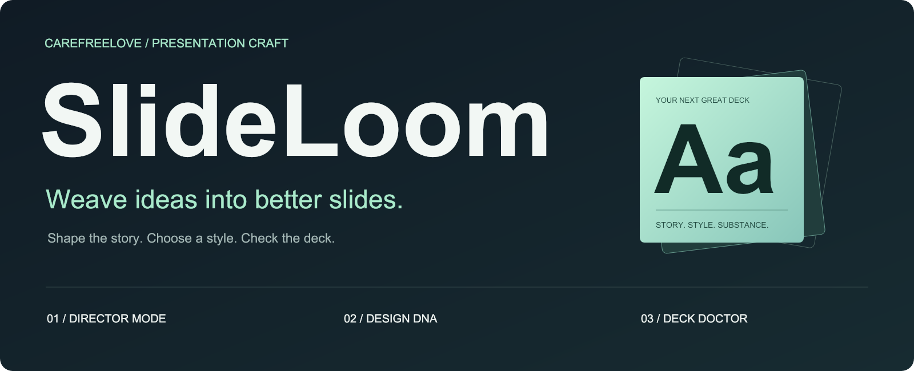

<p align="center">
  <a href="README.md">简体中文</a> · <strong>English</strong>
</p>

<p align="center">
  
</p>

<p align="center">
  <a href="#quick-start">Quick start</a> ·
  <a href="#explore-the-styles">Explore the styles</a> ·
  <a href="#three-ways-to-work">How it works</a> ·
  <a href="#deck-doctor">Deck Doctor</a>
</p>

<p align="center">
  <a href="https://github.com/carefreelove/slideloom/actions/workflows/quality.yml"></a>
</p>

**Turn source material into a clear argument, then into editable slides.**

**SlideLoom** weaves scattered ideas into a presentation with a clear pace and purpose.

Built by [carefreelove](https://github.com/carefreelove), this Codex skill brings storytelling, Chinese typography, and delivery checks into one workflow. Use it for product launches, business reviews, lessons, or focused edits to an existing deck. Specify the language you want for your presentation.

## Explore the styles

One illustrative dataset, three visual directions. These previews are **rendered from the actual PPTX in this repository**. Text and charts remain native objects in the deck.

| Midnight | Editorial | Blueprint |
| :---: | :---: | :---: |
| [](assets/midnight.png) | [](assets/editorial.png) | [](assets/blueprint.png) |
| A dark canvas that emphasizes one finding | Warm paper tones and a clear typographic hierarchy | A light canvas with precise alignment and labels |
| [Design parameters](presets/midnight.json) | [Design parameters](presets/editorial.json) | [Design parameters](presets/blueprint.json) |

[**Download the editable three-slide showcase**](examples/style-showcase.pptx) · [Read the sample storyboard](examples/storyboard.md)

> All showcase data is fictional and used only to demonstrate the styles. Presets provide design parameters for the agent; they are not an automatic theme engine or installed PowerPoint masters. Check font availability on the device used to open the deck. Sample slides, detailed guides, and diagnostic messages are currently in Chinese.

## Quick start

Install from your project's root directory. The destination folder must not already exist:

```bash
mkdir -p .agents/skills
git clone https://github.com/carefreelove/slideloom.git .agents/skills/slideloom
```

Then give Codex your material:

```text
Use $slideloom to turn the attached material into an 8-slide product launch deck in English.
The audience is potential customers. The talk is 6 minutes long. Use the midnight style.
Plan the key point of each slide, then create an editable PPTX. Do not invent missing data.
```

If you installed the version published under the old name, rename its skill folder to `slideloom` and invoke it with `$slideloom`.

For a personal installation, use `~/.agents/skills/slideloom`. Inspect any existing folder before replacing it. Restart Codex if the skill is not detected. See the [official OpenAI documentation](https://learn.chatgpt.com/docs/build-skills) for installation and discovery details.

Run the Python commands below from this repository's root. If you used the project installation above, first run `cd .agents/skills/slideloom`.

## Three ways to work

### 01 / Director Mode — Give the story a clear pace

Define each slide's purpose, evidence, and visual form before allocating speaking time. Condense longer material into a short talk, or ask for a storyboard first. Preserve caveats that affect the conclusion when shortening a deck, including evidence that challenges the main argument.

```text
Use $slideloom to organize this material into a 5-minute presentation.
For each slide, give its purpose, evidence, visual form, and estimated speaking time.
Deliver only the storyboard for now.
```

[Storyboarding method](references/director.md) · [Complete example](examples/storyboard.md)

### 02 / Design DNA — Choose a style, preserve the substance

Three presets define colors, starting font sizes, and layout principles. Supplied templates take priority. Verify actual fonts and line breaks for Chinese text and mixed-language content.

```text
Use $slideloom to restyle this research presentation with the editorial preset.
Keep all data and the original slide count. Charts must remain editable.
```

[Style selection rules](references/style-presets.md) · [Chinese typography guide](references/design.md)

### 03 / Deck Doctor — Make every finding actionable

Read a PPTX offline and get slide numbers, supporting evidence, and suggestions. The tool distinguishes definite errors, potential issues, and informational findings so you can apply judgment.

```bash
python3 scripts/deck_doctor.py examples/style-showcase.pptx --expected-slides 3
```

Director Mode and Design DNA are instructions for the agent. Deck Doctor is a standalone command-line tool. Creating and rendering presentations requires tools supplied by the host environment; no particular commercial plugin is required.

## Deck Doctor

**Python 3.10+ · Standard library only · No network calls · Leaves the source file unchanged**

| Check | Result |
| --- | --- |
| Unexpected slide count or an empty deck | An error with the observed result and expected constraint |
| Potential placeholders such as TODO, TBD, or 待补充 | A warning to review the text; intentional teaching examples can stay |
| Text exceeding the configured threshold | A density warning; the default is 320 non-whitespace characters per slide |
| Pages that may contain only images | A warning to check whether editability requirements are met |
| Hidden slides or identical opening paragraphs | Informational findings that do not automatically reject valid content |

```bash
# Export JSON for another tool
python3 scripts/deck_doctor.py deck.pptx --format json > report.json

# Check an explicit slide count and treat warnings as failures
python3 scripts/deck_doctor.py deck.pptx --expected-slides 8 --strict

# Use the original content extraction interface
python3 scripts/inspect_pptx.py deck.pptx > inspection.json
```

Exit codes: `0` means no failure under the selected policy, `1` means a rule check failed, and `2` means the input or arguments could not be processed. `--strict` returns `1` for warnings as well as errors. Informational findings do not cause failure. See [rules and limitations](references/deck-doctor.md).

Structural checks cannot prove that the layout is correct, the facts are accurate, or every object is editable. Render and inspect each slide before final delivery. The tool does not assign a subjective design score.

## Project structure

```text
slideloom/
├── README.md                  # Chinese guide
├── README.en.md               # English guide
├── SKILL.md                   # Agent workflow entry point
├── agents/openai.yaml         # Codex display metadata
├── presets/                   # Three Design DNA presets
├── references/                # Storyboarding, design, and delivery guidance
├── scripts/
│   ├── inspect_pptx.py         # Read-only content extraction
│   └── deck_doctor.py          # Actionable diagnostics
├── examples/                  # Storyboard and editable showcase
├── assets/                    # Brand visuals and rendered slide previews
└── tests/                     # Offline behavioral tests
```

## Development and validation

```bash
python3 -B -m unittest discover -s tests -v
python3 -B scripts/deck_doctor.py examples/style-showcase.pptx --expected-slides 3 --strict
```

GitHub Actions runs the offline tests on Python 3.10 and 3.12 and checks the included showcase. Repository assets and examples contain no user presentation data. Installing or running the skill does not automatically upload your material to GitHub or any other service.

---

<p align="center">
  <a href="README.md">简体中文</a> · <strong>English</strong>
</p>
