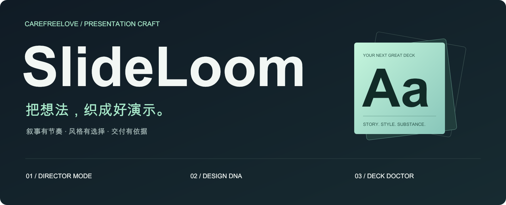
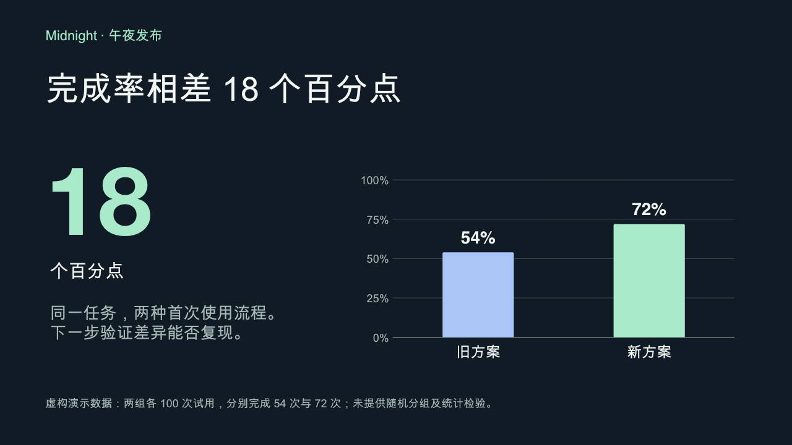
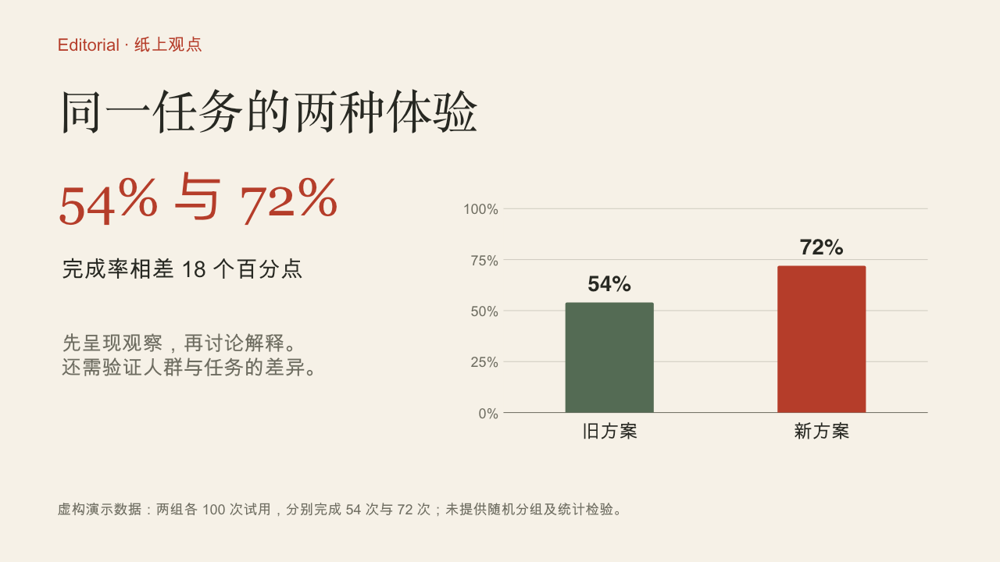
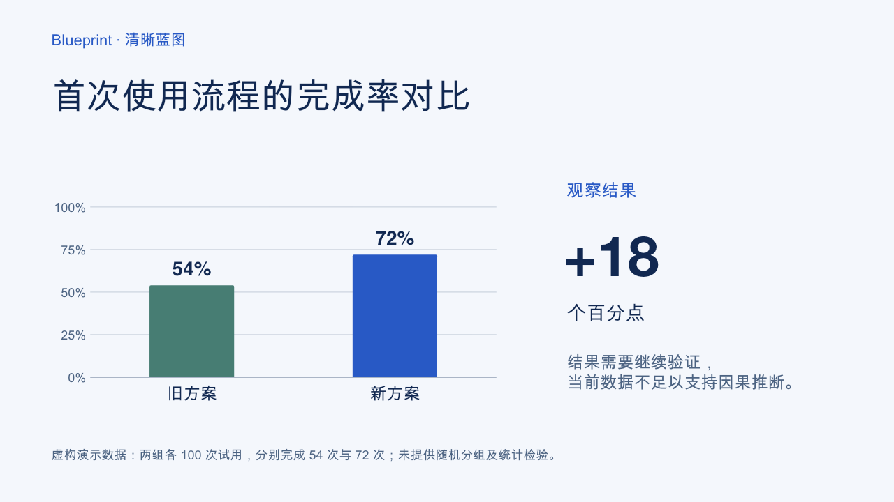

<p align="center">
  <strong>简体中文</strong> · <a href="README.en.md">English</a>
</p>

<p align="center">
  
</p>

<p align="center">
  <a href="#快速开始">快速开始</a> ·
  <a href="#看见风格">看见风格</a> ·
  <a href="#三个工作方式">工作方式</a> ·
  <a href="#deck-doctor">Deck Doctor</a>
</p>

<p align="center">
  <a href="https://github.com/carefreelove/slideloom/actions/workflows/quality.yml"></a>
</p>

**把资料组织成观点，把观点做成可编辑的幻灯片。**

**SlideLoom（幻灯织机）**，把零散资料织成有节奏的演示。

SlideLoom 是 [carefreelove](https://github.com/carefreelove) 打磨的 Codex 演示文稿 skill。它把叙事、中文排版与交付检查放进同一条工作流，适合产品发布、经营汇报、课程讲解，也适合只修改现有 PPT 的几页。

## 看见风格

同一组演示数据，三种视觉表达。下面是仓库中 **真实 PPTX 文件的逐页渲染**，文字和图表在 PPTX 中保留为原生对象。

| Midnight · 午夜发布 | Editorial · 纸上观点 | Blueprint · 清晰蓝图 |
| :---: | :---: | :---: |
| [](assets/midnight.png) | [](assets/editorial.png) | [](assets/blueprint.png) |
| 深色背景，突出一个关键发现 | 暖纸色与文字层级，适合解释观点 | 浅底与规则对齐，适合拆解逻辑 |
| [设计参数](presets/midnight.json) | [设计参数](presets/editorial.json) | [设计参数](presets/blueprint.json) |

[**下载可编辑的三页样稿**](examples/style-showcase.pptx) · [查看示例分镜](examples/storyboard.md)

> 样稿全部使用虚构数据，仅展示视觉效果。预设是 agent 可读取的设计参数，并非一键换肤引擎或已安装的 PowerPoint 母版。字体需在使用设备上验证。

## 快速开始

在目标项目根目录安装，目标文件夹应当尚不存在：

```bash
mkdir -p .agents/skills
git clone https://github.com/carefreelove/slideloom.git .agents/skills/slideloom
```

然后把资料交给 Codex：

```text
使用 $slideloom，把附件整理成一份 8 页中文产品发布稿。
面向潜在客户，讲述时间 6 分钟，选择 midnight 风格。
先组织逐页重点，再生成可编辑 PPT。缺失数据不要编造。
```

已安装旧版时，将 skill 文件夹改为 `slideloom`，并改用 `$slideloom` 调用。

也可以放入个人目录 `~/.agents/skills/slideloom`。已有同名目录时先检查，不直接覆盖。未被发现时重启 Codex。安装机制见 [OpenAI 官方文档](https://learn.chatgpt.com/docs/build-skills)。

下方 Python 命令均在本仓库根目录执行。按上面的项目级方式安装后，先运行 `cd .agents/skills/slideloom`。

## 三个工作方式

### 01 / Director Mode — 让讲述有节奏

先明确每页的目的、证据和视觉，再分配讲述时间。支持从完整资料压缩成短演讲，也支持先交大纲。缩短时保留影响结论的限制条件，不靠删掉反面证据来增强说服力。

```text
使用 $slideloom，把这份材料组织成 5 分钟的汇报。
每页给出目的、证据、视觉形式和预计用时，先只交分镜。
```

[分镜方法](references/director.md) · [完整示例](examples/storyboard.md)

### 02 / Design DNA — 选择气质，保留内容

三个预设提供配色、字号起点和布局原则。已有模板时优先保留模板；中文与中英混排都要检查实际字体和换行。

```text
使用 $slideloom，把这份研究介绍改成 editorial 风格。
保留全部数据和页数，图表需要可以继续编辑。
```

[风格选择规则](references/style-presets.md) · [中文排版指引](references/design.md)

### 03 / Deck Doctor — 给每个提醒一条依据

离线读取 PPTX，给出页码、问题证据和修改建议。区分确定错误、候选问题和普通信息，保留人工判断。

```bash
python3 scripts/deck_doctor.py examples/style-showcase.pptx --expected-slides 3
```

Director Mode 和 Design DNA 是 agent 工作指引；Deck Doctor 是可以单独运行的命令行工具。生成与渲染 PPT 仍由宿主环境提供，不要求绑定某个商业插件。

## Deck Doctor

**Python 3.10+ · 标准库 · 无网络调用 · 不修改原文件**

| 检查什么 | 怎么处理 |
| --- | --- |
| 页数与要求不一致、空演示稿 | 报错，给出实际值与约束 |
| TODO、TBD、待补充等候选占位词 | 提醒核对，允许教学示例保留 |
| 每页文本超过配置阈值 | 提醒精简，默认 320 个非空白字符 |
| 可能只有图片的页面 | 提醒检查是否满足编辑要求 |
| 隐藏页、多个页面首段相同 | 提供信息，避免误删正常内容 |

```bash
# 用 JSON 接入其他工具
python3 scripts/deck_doctor.py deck.pptx --format json > report.json

# 对明确页数执行检查，并将 warning 视为失败
python3 scripts/deck_doctor.py deck.pptx --expected-slides 8 --strict

# 保留原有的底层内容抽取接口
python3 scripts/inspect_pptx.py deck.pptx > inspection.json
```

退出码：`0` 表示当前退出策略下没有失败，`1` 表示规则检查失败，`2` 表示输入或参数无法处理。`--strict` 对 warning 返回 `1`；info 不阻断。详见 [规则与限制](references/deck-doctor.md)。

结构检查不能证明排版正确、事实准确或全部内容可编辑。正式交付仍需渲染并逐页查看。工具不会给出没有依据的“美观度分数”。

## 项目结构

```text
slideloom/
├── README.md                  # 中文说明
├── README.en.md               # English guide
├── SKILL.md                   # agent 工作入口
├── agents/openai.yaml         # Codex 展示信息
├── presets/                   # 三种 Design DNA
├── references/                # 分镜、设计、交付与检查规则
├── scripts/
│   ├── inspect_pptx.py         # 只读抽取
│   └── deck_doctor.py          # 可执行诊断
├── examples/                  # 分镜示例与可编辑样稿
├── assets/                    # 品牌视觉与真实样稿预览
└── tests/                     # 离线行为测试
```

## 开发与验证

```bash
python3 -B -m unittest discover -s tests -v
python3 -B scripts/deck_doctor.py examples/style-showcase.pptx --expected-slides 3 --strict
```

GitHub Actions 在 Python 3.10 / 3.12 上执行离线测试，并检查仓库中的样稿。素材与样稿不含用户演示数据；安装或运行此 skill 不会自动向 GitHub 或其他服务上传资料。

---

<p align="center">
  <strong>简体中文</strong> · <a href="README.en.md">English</a>
</p>
